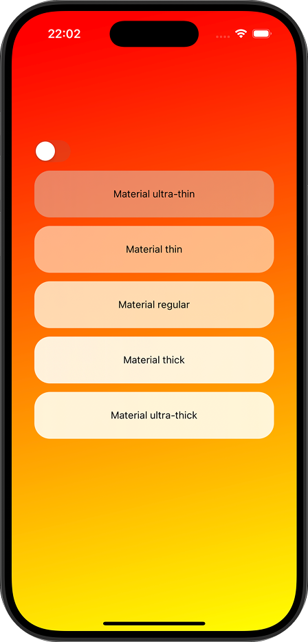
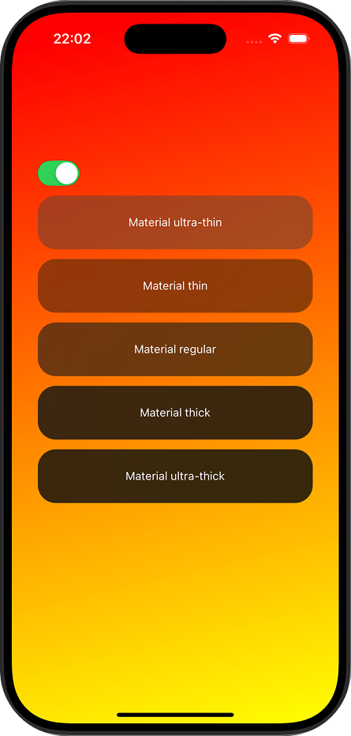
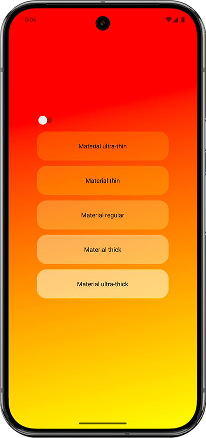
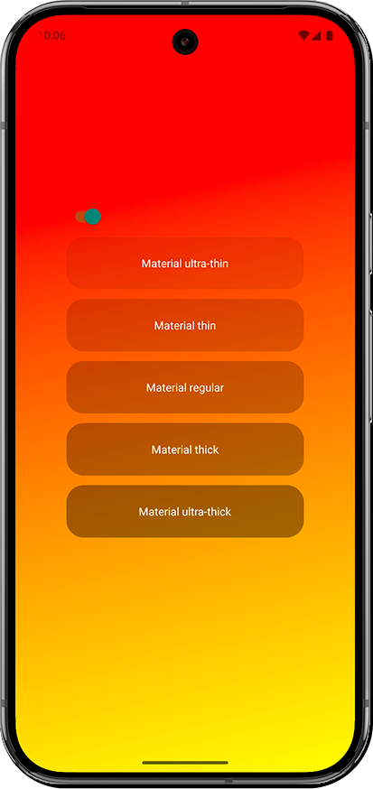

# @janblazej/react-native-materials

A cross-platform React Native component for applying Material, using native SwiftUI Materials on iOS and RenderEffect on Android to mimic the same effect.


## Screenshots

| iOS Light                            | iOS Dark                           | Android Light | Android Dark |
|--------------------------------------|------------------------------------|---------------|--------------|
|  |  |  |  |

> _Add screenshots above to show the effect on each platform and theme._


## Features
- **iOS:** Uses [SwiftUI Material](https://developer.apple.com/documentation/swiftui/material) for native, high-performance backgrounds.
- **Android:** Uses [RenderEffect](https://developer.android.com/reference/android/graphics/RenderEffect) to approximate iOS Material blurs.
- **Unified API:** Same props and behavior on both platforms.
- **Automatic color scheme:** If `variant` is not set, the component adapts to the system color scheme (light/dark).


## Installation

```sh
yarn add @janblazej/react-native-materials
```

> **Note:** After installing, you need to prebuild your app to generate the native code. Run:
>
> ```sh
> npx expo prebuild
> ```
>
> This step is required for the native modules to be linked in your project.


## Usage

```tsx
import { MaterialView } from '@janblazej/react-native-materials'

<VStack>
    <MaterialView material="thin" style={StyleSheet.absoluteFill} />
    <Text>Material</Text>
</VStack>
```


## Props

| **Prop**   | **Type**                                                    | **Default** | **Required** | **Description**                                                                 |
|:-----------|:------------------------------------------------------------|:-----------:|:------------:|:-------------------------------------------------------------------------------|
| `material` | `'ultra-thin'` \| `'thin'` \| `'regular'` \| `'thick'` \| `'ultra-thick'` | `'regular'`  |   No        | Material                                       |
| `variant`  | `'light'` \| `'dark'`                                       |  auto       |    No        | Forces light/dark appearance. If not set, uses system color scheme.            |
| ...ViewProps| [ViewProps](https://reactnative.dev/docs/view#props)        |    —        |    No        | All standard React Native View props.                                           |


## Native Implementations
- [iOS SwiftUI MaterialView.swift](./ios/MaterialView.swift)
- [Android MaterialView.kt](./android/src/main/java/com/janblazej/materials/MaterialView.kt)


## License
MIT
